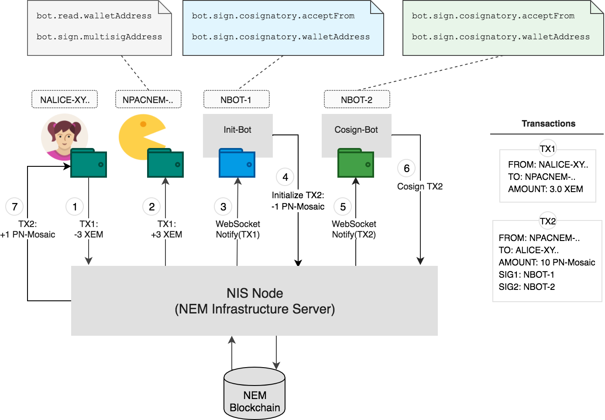
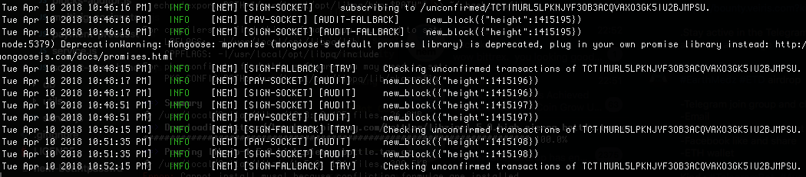
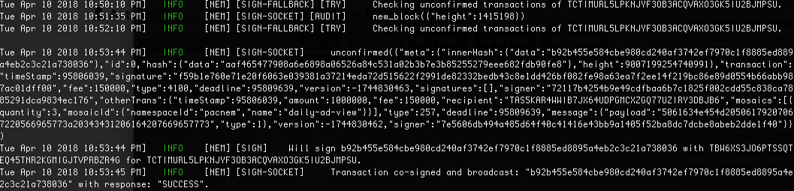
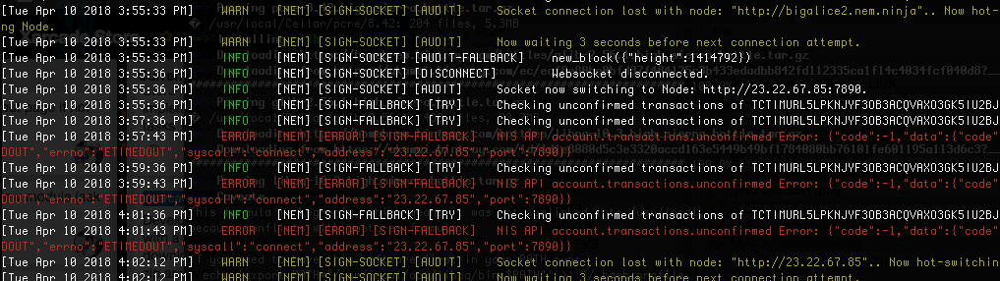

nem-nodejs-bot: Node.js Bot for the NEM blockchain
==================================================

This is a multi-feature bot written in Node.js for the NEM blockchain. It can be deployed to Heroku free tiers or served locally.

The main features of this bot include **listening** to incoming account **transactions** or account data modifications and **co-signing**
multi-signature accounts **transactions**.

Overview
--------

The **NEMBot** aims to be hidden such that Websites using the Bot for *payment processing*, never **directly** communicate with the bot.
This helps securing the signing features and gives more privacy to any company using the NEMBot for their payment processor (e.g.
NEMPay).

Socket.io is used to proxy the communication between the NEMBot and your Node.js express app. This is to avoid addressing
your NEMBot instance over HTTP or Websocket **directly** (which is traceable in the network console). I decided to implement a proxying mechanism using Socket.io that is placed between the frontend and the bot, so **even reading is kept private**.

The multisignature co-signing features do not use any other **communication** protocol than the **NEM Blockchain** itself! This is possible by using the *Multi Signature Account Push Notification System* which is part of the NEM blockchain core. Communicating only through the NEM Blockchain is a security feature that avoids disclosing locations of the NEMBot instance(s) used for co-signing.

The NEMBot also provides a HTTP/JSON API for which the endpoints will be listed in this document. The HTTP/JSON API should only provide a READ API such that the database of the NEMBot(s) can be read. **In the current state of development, however, there is an /api/v1/reset API endpoint to RESET the NEMBot data**. Please be aware of this if you decide to use the NEMBot already.

This bot can secure your application in a new way as you deploy **any amount** of NEMBot instances to **co-sign** your multi-sig account's transactions. This way you can configure a secure multi-sig infrastructure and let the NEMBot handle co-signing automatically.

Example Flow
------------
In the following, an example flow is introduced which leverages both the **listening** as well as the **co-signing** core features of NEMBot. In this scenario, Alice has the public key `NALICE-XY..` and wants to send 3 XEM to `NPACNEM-..` in order to receive 1 PN-Mosaic.




1. Alice signs `TX1` to send 3 XEM to `NPACNEM-..`, which is a multi-signature wallet
2. `NPACNEM-..` receives `TX1` containing 3 XEM
3. The responsible NIS Node notifies the init-bot (`NBOT-1`) about the payment through a web socket connection. 
4. The init-bot is one of the accepted co-signatories who are allowed to initiate transaction on behalf of `NPACNEM-..`. It initiates `TX2` to send 1 PN-Mosaic to Alice in exchange for her payment.
5. The responsible NIS Node notifies the cosign-bot (`NBOT-2`) about the pending co-sign transaction `TX2` through a web socket connection.
6. The cosign-bot is one of the accepted co-signatories as well.
7. Alice receives 1 PN-Mosaic.

Dependencies
------------

This package uses the ```nem-sdk``` package and the ```nem-api``` package as a showcase for both libraries. ```nem-sdk```
can be used to perform any kind of HTTP request to the blockchain API, while ```nem-api``` supports both HTTP requests
and Websockets (which we will use).

This project will implement a mix of both libraries. First, the nem-api package is used to connect to the Blockchain using
Websockets and the nem-sdk library is used as a second layer of security whenever websockets process relevant data.

Also, a Websocket fallback is implemented using the ```nem-sdk```, such that Payment Processing never misses a Transaction
and Co-Signing neither. (Features in the source code are separated into PaymentProcessor and MultisigCosignatory classes).

Installation
------------

The bot can be configured to execute any of the following features:
 - Payment Channel Listening (mode **read**)
 - Balance Modifications Listening  (mode **read**)
 - Multi Signature Transaction Co-Signing (mode **sign**)
 - Cosignatory Auditing (mode **read**) *not yet implement*
 - Tip Bots (HTTP/JSON API) (mode **tip**)*not yet implement*

Only SIGN and TIP features need your Private Key, change the "mode" config to "read" or "sign" or "tip" or "all" to enable/disable read and write.
You can also use an array for configuring the bot to use ["read", "tip"] features for example. The tipper bot features also need a Private Key.

For a local installation, first install the dependencies of this package. Using the terminal works as follows:
```
    $ cd /path/to/this/clone
    $ npm install
```

You should now take a look at ```config/bot.json``` and configure your Bot instance. Editing the **walletAddress** is obligatory.

After configuration, you can start the Bot, locally this would be:
```
    $ node run_bot.js
```

Your bot is now running on localhost! The **API** is published on **port 29081** by default.

The config/bot.json file will only be removed in "production" mode. The environment is defined by the **APP_ENV** environment variables and
default to **development**.

Configuration
-------------

The ```config/bot.json``` configuration file contains all configuration for the NEMBot. Following are details for each of the field in this
configuration field:

```
    - bot.mode : Type: text. Possible values: "read", "sign", "tip", "all". Defines the Type of Bot.
        - overwrite with environment variable BOT_MODE
    - bot.name : Type: text. Labelling for your NEMBot.
    - bot.protectedAPI : Type: boolean. Whether to enable HTTP Basic Auth (true) or not (false).
    - bot.db.uri : Type: text. MongoDB URI, only used if MONGODB_URI and MONGOLAB_URI env variables are not provided (non-heroku).
        - overwrite with environment variable MONGODB_URI

    Payment Processing
    -------------------
    - bot.read.walletAddress : Type: text. XEM Address of the Account for which the Bot should Listen to Payments.
        - overwrite with environment variable BOT_READ_WALLET
    - bot.read.duration : Type: integer. Default Payment Channel duration (5 minutes) - expressed in Milliseconds.
    - bot.read.useTransactionMessageAlways: Type: boolean. Whether to require Messages in transactions or not. **experimental for now only with messages tested**

    MultiSig Co-Signing
    -------------------
    - bot.sign.multisigAddress : Type: text. XEM Address of the Multi Signature Account of which this Bot is a Co-Signatory.
    - bot.sign.cosignatory.walletAddress : Type: text. XEM Address of the Account to **use** for Co-Signing Multi Signature Transactions.
        - overwrite with environment variable BOT_SIGN_WALLET
    - bot.sign.cosignatory.privateKey : Type: text. Private Key of the Account to **use** for Co-Signing Multi Signature Transactions. (Should be the Private Key of the Account ```bot.sign.walletAddress```).
    - bot.sign.cosignatory.acceptFrom : Type: text. Public Key of accounts from which we will accept unconfirmed transactions.
    - bot.sign.dailyMaxAmount : Type: number. Maximum amount of Micro XEM to allow in co-signer mode.
    - bot.sign.onlyTransfers : Type: boolean. Whether to sign other transaction than Transfer *not yet implemented*

    Tipper Features
    ---------------
    - bot.tipper.walletAddress : Type: text. XEM Address of the Account to use for Tipping. (Sending money in demande of tippers)
        - overwrite with environment variable BOT_TIPPER_WALLET
    - bot.tipper.privateKey : Type: text. Private Key of the Account to use for Tipping. (Should be the Private Key of the Account ```bot.tipper.walletAddress```)

    NEM Blockchain Configuration
    ----------------------------
    - nem.isTestMode : Type: boolean. Whether to work with the Testnet Blockchain (true) or the Mainnet Blockchain (false).
        - This option defines wheter we will be using a Testnet blockchain or not!
    - nem.isMijin : Type: boolean. Whether we are using Mijin Network (true) or not (false).
    - nem.nodes[x]: Type: object. Configure Mainnet default Blockchain Nodes.
    - nem.nodes_test[x]: Type: object. Configure Testnet default Blockchain Nodes.
```

Deploy on Heroku
----------------

This NEM Bot is compatible with heroku free tiers. This means you can deploy the source code (AFTER MODIFICATION of config/bot.json)
to your Heroku instance and the Bot will run on the heroku tier. Before you deploy to the Heroku app, you must configure following
```Config Variables``` in your Heroku App (Settings) :
```
    - Required:
        - APP_ENV : Environment of your NEMBot. Can be either production or development.
        - ENCRYPT_PASS : Should contain the configuration file encryption password. (if not set, will ask in terminal)
        - PORT : Should contain the Port on which the Bot HTTP/JSON API & Websockets will be addressed.

    - Recommended:
        - BOT_MODE : overwrite config.bot.mode.
        - BOT_READ_WALLET : overwrite config.bot.read.walletAddress
        - BOT_MULTISIG_WALLET : overwrite config.bot.sign.multisigAdress
        - BOT_SIGN_WALLET : overwrite config.bot.sign.cosignatory.walletAddress
        - BOT_SIGN_PKEY : overwrite config.bot.sign.cosignatory.privateKey
        - BOT_TIPPER_WALLET : overwrite config.bot.tipper.walletAddress

    - Optional :
        - NEM_HOST : Mainnet default NEM node. (http://alice6.nem.ninja)
        - NEM_PORT : Mainnet default NEM node port. (7890)
        - NEM_HOST_TEST : Testnet default NEM node. (http://bob.nem.ninja)
        - NEM_PORT_TEST : Testnet default NEM node port. (7890)
```

HTTP Basic Authentication
-------------------------

You can specify basic HTTP auth parameters in the **nem-bot.htpasswd** file. Default username is **demo** and default password
is **opendev**. To enable basic HTTP auth you must set the option "bot.protectedAPI" to ```true```, the Bot will then
read the nem-bot.htpasswd file for HTTP/JSON API endpoints. Of course **you should not commit when you update the .htpasswd file.**

In case you plan to use the protectedAPI option, make sure to update the **nem-bot.htpasswd** file with your new username/password combination,
and also to disable the default login credentials, like so:
```
    $ htpasswd -D nem-bot.htpasswd demo
    $ htpasswd nem-bot.htpasswd yourSecureUsername
```

Usage Examples
--------------

### Example 1: Automatic MultiSignature Account Co-Signatory NEMBot

The NEMBot can also be used as a Multisignature Co-Signatory for your Multisignature Account. When you install the NEMBot and enable the `sign` Mode, you  will also need 
to configure the `bot.sign.cosignatory.acceptFrom`, the `bot.sign.cosignatory.walletAddress` (optional) and the `bot.sign.cosignatory.privateKey` options in the `config/bot.json` file. Once you have done this, you can startt the NEMBot
(or leave it unstarted and start it only every time you want it to co-sign something).

The NEMBot will connect to the NEM Blockchain Node Websockets and listen for unconfirmed 
transactions that it will process automatically and Co-Sign with the configured 
`cosignatory.privateKey`. 

Currently only the `cosignatory.acceptFrom` limitation is used but I plan to integrate 
several other Transaction Co-Signing Validation features such as:

* Maximum Daily Amount for Automatic Co-Signing
* Transaction Data Auditing features implement in SigningRules

This bot can be very handy when you have more than one Co-Signer and don't want to do the
signing manually from the NanoWallet. Instead you could execute `node run_bot.js` whenever
you need the Bot to co-sign a transaction - or even better, leave the Bot running and have
it proceed transactions automatically, restricting the Transaction Initiator to `bot.sign.cosignatory.acceptFrom` public key.

### Example 2: Payment Processor NEMBot (Invoice Payment Processing)

This example implements following Flow:

    - FRONTEND creates an invoice for someone to pay something
    - BACKEND opens a payment channel with NEMBot to observe incoming transactions
    - NEMBot informs the BACKEND of payment status updates (when there is some)
    - BACKEND informs the FRONTEND of the payment status updates (when there is some)

This can be understood as follows:

```
    Frontend  >   Backend >   NEMBot ->|
                                       |
                             ---------------------
                             | NEM Blockchain    |
                             ---------------------
                                       |
    Frontend  <   Backend <   NEMBot <-|
```

So lets define the details about this scenario. Your BACKEND will use socket.io to send events
to your FRONTEND and then the BACKEND also uses socket.io to communicate with the NEMBot.

```
// BACKEND:
// This comes in your Node.js backend (usually app.js)
// and will configure the BACKEND to FRONTEND Websocket communication
// ----------------------------------------------------

var io = require("socket.io").listen(expressServer);

var frontends_connected_ = {};
io.sockets.on('connection', function(socket)
{
    console.log("a frontend client has connected with socket ID: " + socket.id + "!");
    frontends_connected_[socket.id] = socket;

    socket.on('disconnect', function () {
        console.log('a frontend client has disconnected [' + socket.id + ']');
        if (frontends_connected_.hasOwnProperty(socket.id))
            delete frontends_connected_[socket.id];
    });
});

// example is GET /create-invoice?client=XXX_sfwe2
expressApp.get("/create-invoice", function(req, res)
{
    var clientSocketId = req.query.client ? req.query.client : null;
    if (! clientSocketId || ! clientSocketId.length)
        res.send(JSON.stringify({"status": "error", "message": "Mandatory field `Client Socket ID` is invalid."}));

    // do your DB work ..

    // now start a payment channel with the bot.
    startPaymentChannel(clientSocketId, function(invoiceSocket)
        {
            // payment channel is now open, we can end the create-invoice response.
            res.send({"status": "ok"}, 200);
        });
});

var startPaymentChannel = function(clientSocketId, callback)
    {
        var client = require("socket.io-client");

        // connect BACKEND to your NEMBot
        // => your BACKEND will be notified by your bot, not your FRONTEND!
        var invoiceSocket = client.connect("ws://localhost:29081");

        // open a new payment channel. The "message" option should contain your invoices
        // UNIQUE message.
        var channelParams = {
            message: "MY-INVOICE-123",
            sender: "TATKHV5JJTQXCUCXPXH2WPHLAYE73REUMGDOZKUW",
            recipient: "TCTIMURL5LPKNJYF3OB3ACQVAXO3GK5IU2BJMPSU"
        };
        invoiceSocket.emit("nembot_open_payment_channel", JSON.stringify(channelParams));

        // register FORWARDING to FRONTEND
        // => notify the FRONTEND from your BACKEND, only the frontend => backend communication is disclosed.
        invoiceSocket.on("nembot_payment_status_update", function(rawdata)
            {
                var data = JSON.parse(rawdata);

                // forward to client.. "clientSocketId" is important here.
                io.sockets.to(clientSocketId)
                  .emit("myapp_payment_status_update", JSON.stringify({"status": data.status, "realData": rawdata}));
            });

        callback(invoiceSocket);
    };
```

```
// FRONTEND:
// this comes in your jQuery (or any other) Frontend HTML Templates
// and will print to the console everytime a payment status update
// is received from your backend. The Frontend nevers communicates
// with the NEMBot directly.
// ----------------------------------------------------------------

<script src="/socket.io/socket.io.js"></script>
<script type="text/javascript">
    // connect to our BACKEND using socket.io
    var frontendSocket = io.connect(window.location.protocol + '//' + window.location.host);

    frontendSocket.on("myapp_payment_status_update", function(rawdata)
    {
        // this will display in the Javascript Console of your Browser! (only for this frontendSocket!)
        console.log("received myapp_payment_status_update with: " + rawdata);
    });
</script>
```

Occasional Errors / Maintenance
-------------------------------

Let's first see an example of working unconfirmed transaction listening:



When you activate the co-signature features of the Bot(s), you will see the following example log when *any* transaction is co-signed. Features for *interactive co-signing* have not yet been implemented.



It will sometimes happen that your Bot(s) cannot connect to given NEM nodes. This may happen due to connectivity issues on side of the NEM nodes. 

Following is an example of logging that happens when errors are being hit for a said node connection:



Pot de vin
----------

If you like the initiative, and for the sake of good mood, I recommend you take a few minutes to Donate a beer or Three [because belgians like that] by sending some XEM (or whatever Mosaic you think pays me a few beers someday!) to my Wallet:
```
    NB72EM6TTSX72O47T3GQFL345AB5WYKIDODKPPYW
```

License
-------

This software is released under the [MIT](LICENSE) License.

© 2017 Grégory Saive greg@evias.be, All rights reserved.
